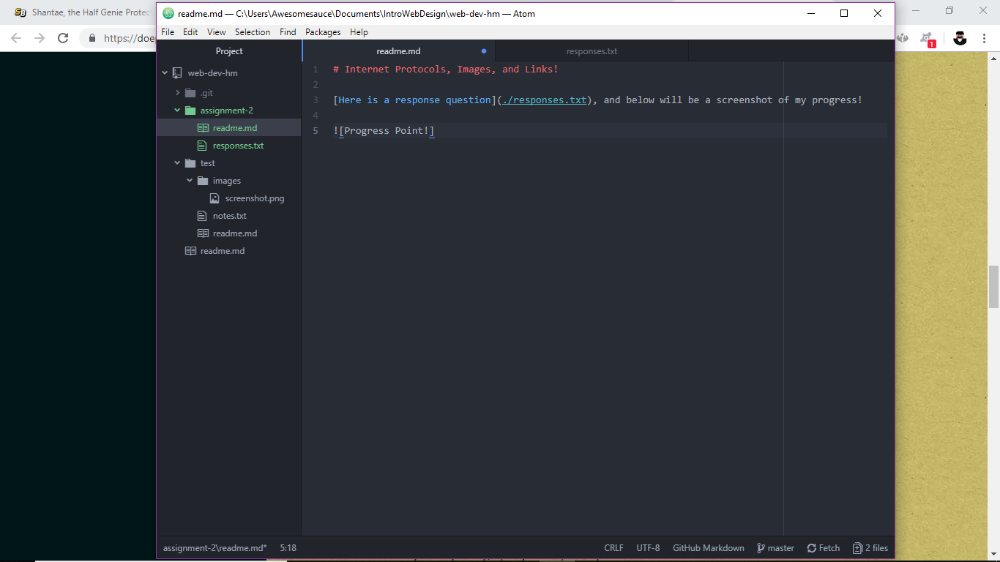

# Internet Protocols, Images, and Links - Usage of Version Control System based Gits!

A Version Control System is a system that can give a developer control over which version can be showcased to you at any time. This system will prompt users to label their commitments, so that future bosses and yourself can obtain a generalized timeline about your versions. When you accidentally delete a piece of code or markdown that has something important, you can reference an older version with this markdown intact and reuse it. In a collaboration, everyone can keep track of commitments made out by other people, which can tell others what they've done and why they've done that. After which, a merge may happen, in which the document(s) you've worked on will end up coming together into one complete form.

[Here is a response question](./responses.txt), and below will be a screenshot of my progress!

## Work Cycle Report

- For this particular assignment, I found myself referring back to Assignment 1's lone readme.md, primarily to review markdown techniques that will be used in this assignment. Other things I did was doing the test for Assignment 2, trying to get down the newer concepts it introduced.
- There were no real problems on my end.
- I think I would like to go into relative URLs a bit more, since it feels more interesting to do than with absolute URLs.
- I had no real problems with this assignment in general and I felt most of the classmates had no problems either, since it's an expanded version of Assignment 1.

