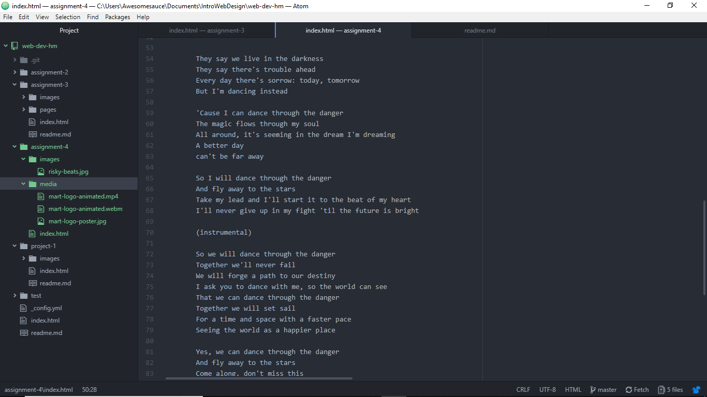

# Multimedia Madness! From HTML to Audio and Video Sources!

Divs are essentially block-level elements where a coder can group other element forms; classes are generalized organizers, separating content based on their elements and how they're grouped by name, though they are not limited to a unique name; ids are identities, meant for specific leveled groups that are sorted out by a unique name and only that unique name; spans are inlined div elements, though they see a specific use in identifying text that needs to appear visually unique in the rendered HTML.

"Alt text" or "escape" characters are special characters that normally cannot by typed out without indicating a mark-up or, with certain characters like ™ (# 153) or © (# 169) requiring to be typed out with an ampersand and a code number. It also sees surprisingly good use with blocking out "middle-man attacks"

## Work Cycle Time!

- For the majority of this project, I simply followed what to do based from the websites. My sources are Jake Kaufman's Bandcamp, Christina Vee's YouTube, and the Shantae Wikia for the lyrics.
- Funny enough, on a website called "KnowYourMeme", I had to use the embed feature to feature a video on their comments section. So the iframe portion of the assignment was easy enough for me. Though it is intriguing to embed audio and maps through iframes as well, so in a way, it's a "Today, I Learned" moment.
- To be honest, I never saw myself using the spans element. Perhaps we should find good use for it in the future?
- One thing that's bugging me in particular is the lack of the codecs after the file type and one particular student putting all his head elements into the body element. I told them about what could be lacking in their code through the forums. I do have a problem, and it does rely on the video files, mainly that I don't have both the mp4 file and the webm file on display. Is this a deliberate choice by HTML's design?

