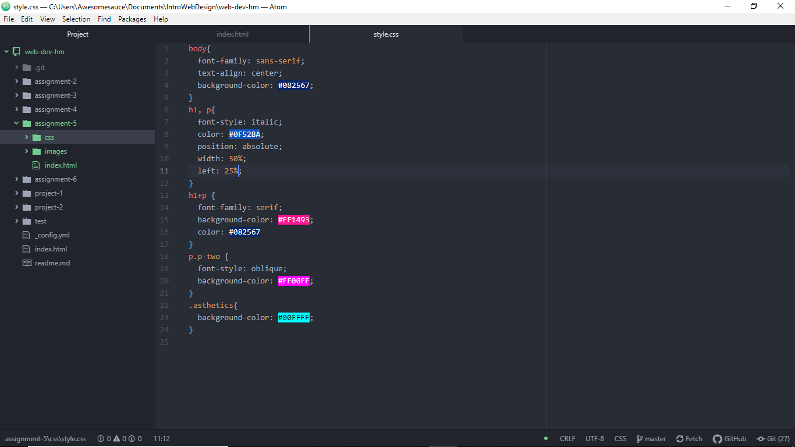

# Frustration and Fury, I got Styled Upon by CSS!

I've elected to use the 1990's style, followed by the wire framed trees and the 90's sticker, since I loved the bright, obnoxious colors present in the decade. With that, I've also limited my pallets to pinks, blues, and cyans as those represent the colors in a way I can see it work. In a way, I've also wanted to style the site intentionally bad, with only blocky color squares and otherwise undesirable design choices that makes a website look like it came straight from the 90's.

The main three colors I've used that doesn't involve cyan(#00FFFF) or magenta(#FF00FF) is a personal favorite of mine: Dark Sapphire(#082567), Hot Pink(#FF1493), and a lighter, but still pretty obnoxious Sapphire Blue(#0F522BA).

## Work Cycle Time!

- From what I've tried, I wanted to do more with my website than what was presented. However, due to time constraints and just a general berserker fury gotten by not necessarily knowing how to properly style, I ended up with what I have. I would have loved to have an entire div contain the h2 and paragraph elements, but since HTML and CSS were not kind to me, I relented and ended it before I gave myself an aneurysm trying to learn the proper and correct way to do this.
- As stated above, I had problems with utilizing the id and class elements in such a way I couldn't do the text-container portion of the styling. Most of what would happen would simply be that the container portion wouldn't happen or it'd get completely clowned on by my magenta and cyan squares. The most I could do is to simply experiment with the text class elements and get rid of the css code for both the squares and the text-container.
- The lightest I knew was the difference between using a period and the pound symbols to represent classes and ids respectively. However, I want to explore it much further so I can actually do something similar to what you've done with your "I <3 2000's" web page! It's so wicked and I desperately want to know how to do it without having other ids or classes' styles overtake it!
- Unfortunately no. This is a later submission I've done since I didn't think to try to get a minimalized, but passable version of this assignment in before it was due. I basically self-defeated myself by this alone.

