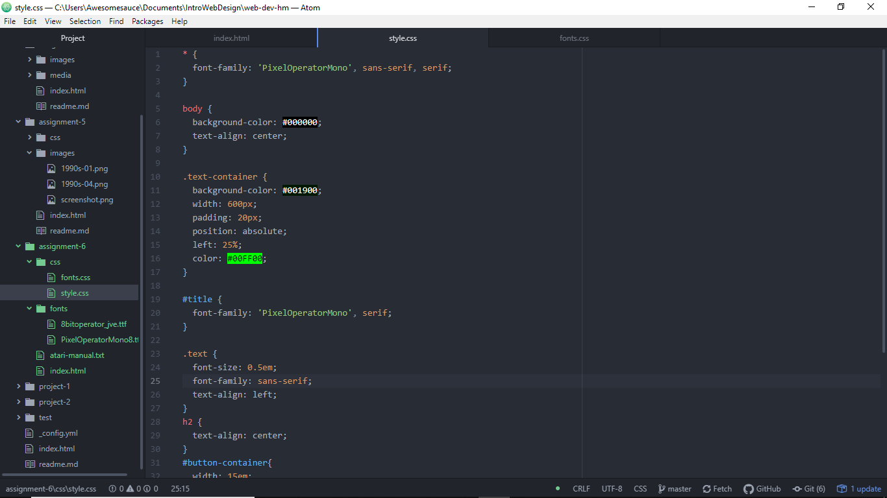

# Asteroids and Text Styles! How One Font Family Won While the Other Failed!

There were supposed to be two fonts I've used that I've downloaded: PixelOperatorMono8 and 8bitoperator_jve. The former worked wonders and acts as the headings, but 8bitoperator_jve for the paragraph elements had to be replaced with sans-serif since it was inoperable. Upon seeing it in action, however, it worked well enough that I kept it there! It was supposed to look like a computerized message that would have been sent from far away, hence the strong focus on greens and blacks. And what better fonts to use than more "pixelated" fonts as well as a size-reduced sans-serif?

System fonts are utilized on most computers and already comes pre-installed. They rarely see use outside your computer due to licensing issues. Web fonts are customized fonts that appear on most pages, though fonts can vary computer performances greatly if there's an abundance of fonts, despite being optimized for usage on the web. Web-safe fonts are fonts that are both preinstalled on most computers and are able to be cross-platform onto other OS' if they have the font installed, too.

## Work Cycle

- Thanks to the knowledge that Cascade really does mean "cascade", I was more prepared for corrections and creating something different enough from last time. This time, I did stay to being on the minimalistic side, using only greens and blacks for the primary pallet, since it did revolve around an older game and most computers back in the day had green text on a black screen
- Two problems I had were that there's no "grid" (green rectangles that go from one side of the screen to the other to form a square grid) asthetic to it and the second custom font I had didn't download right. Solution to both, really, just omit them, since they don't have too much a stake in what'll happen next. And just recently, I found out that you need to stick the rgba command next to () in order for it to read opacity.
- This just had the right amount of knowledge, though if anything, I would love to do more font downloading and finding out how to make them work better in stuff like this.
- Nope!

