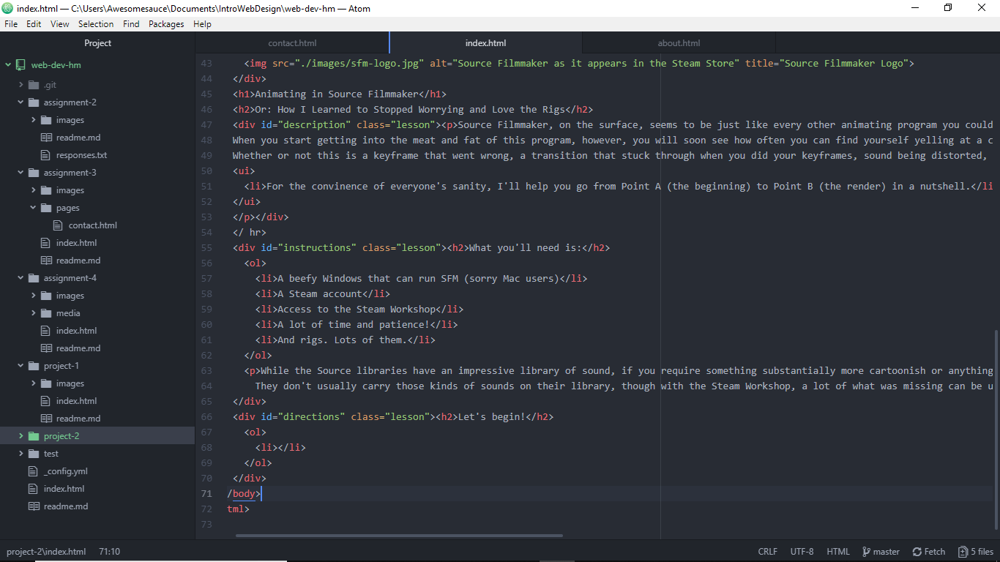

# The Work of A Few Hours! Dedicated Styling for Class Time!

In what has transgressed over these few hours, A lot of these HTML prompts were old stuff I had to deal with back in High School. It was for an Animation Class, but I finished Flash too fast and took HTML to help fill out the rest of the semester. So I did have some HTML experience, but a lot of what I had to do was new, exciting, and difficult for me. Just my favorite type of class, too!

It'll be quite the trip to actually learn CSS, since that has not been one I've learned throughout my years of being taught HTML coding. Though I do think it'll be difficult for me to not make my page look like either a basic, generic site with noting new or like a portrait of a clown vomiting all over my screen with eye-burning bright colors.

## Work Cycle

- For most of this assignment, a lot of what I had to do in style was actually quite new! Of course, it didn't help that I am like me and I do my work when it's starting to cut it pretty short. Overall, I did not learn as much about styling in HTML as I would have, though I've learned enough that, for the most part, my information is presented in a way that it's organized.
- The lessons here didn't railroad me into doing a particular way to style my site, so I simply took to utilizing what information was there and applying it, eventually getting to the tabbed look for my navigation on top.
- One of the more intriguing things I'd like to learn would have been how to embed a video by using Classes, since I did have the render on-hand.
- My best advise for my classmates would to be that you can actually do a separate style for unordered lists and ordered lists. However, do try your best to not bork up the ordered list to the point the numbers don't appear and you have to insert them yourself.

