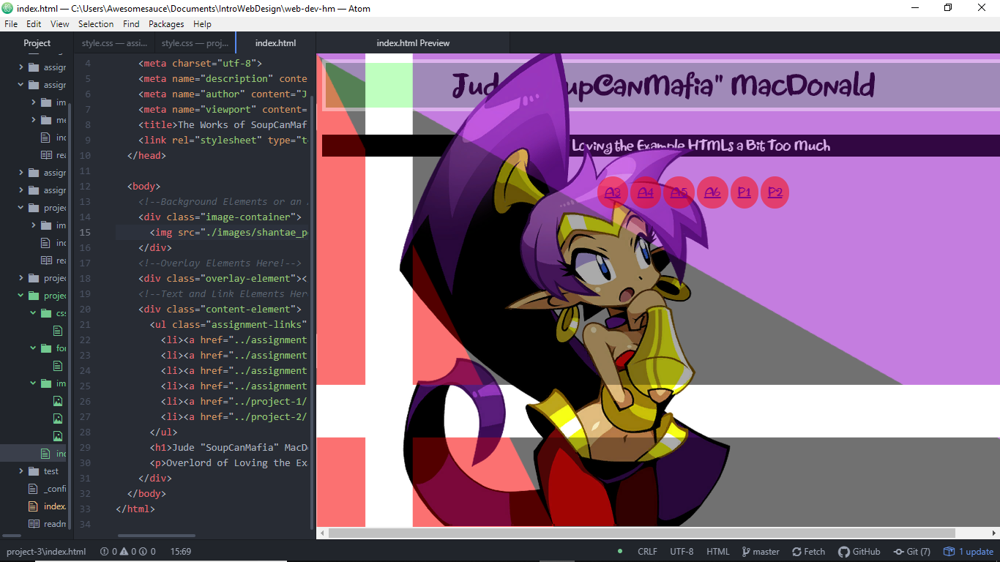

# The Grand Finale! A Journey Spanned Throughout CSS and HTML!

Padding is the separation of space between the inner block of content and the content itself. Borders simply places walls cutting off the content from other elements. Margins space out a piece of content from other pieces of content.

For me, the most difficult thing to do is overlapping elements. As you could have told from my screenshot, while I was able to get my overlay over the picture I've set in (Shantae, relating to the fact she's my go-to for a lot of these assignments), I was not able to get the text portions of the content to go over the overlay itself, but getting it to appear over her was so good that it was worth enough effort to keep it as is.

## Work Cycle

- Even with what I knew about CSS, I did feel that it was not enough that everything went together as-is. I decided to add in Jewels, a Shantae font, since that's where I got most of my inspiration from. As well, I instead did a "boss" subtitle underneath my name (the quotation marked nickname is my internet handle).
- One thing I would have loved to learn more about was involving Figures and Forms. By accident, the link that was provided to me lead to a different form of the Web Development webpage. Mainly for the fact that it'd be awesome to make an online image gallery
- I would have loved to fully find out how to take the text elements and have it appear so that they float above the image elements.
- Nope!

